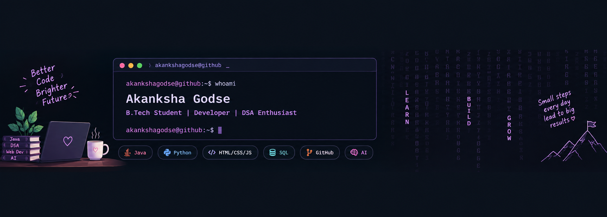

<!-- ===================== BANNER ===================== -->

  

<!-- ===================== INTRO ===================== -->

<h1 align="center">
  Hi 👋, I'm Akanksha Godse
</h1>

<h3 align="center">
  B.Tech Student | Software Developer | DSA Enthusiast
</h3>

  <i>Learning • Building • Solving • Growing 🚀</i>

---

<!-- ===================== ABOUT ME ===================== -->

## 👩‍💻 About Me

- 🎓 B.Tech student at **MKSSS's Cummins College of Engineering for Women, Pune**
- 💻 Interested in **Software Development, Data Structures & Algorithms, and Full Stack Web Development**
- 🧩 Enjoy solving programming problems and building practical applications
- 🤖 Exploring **Generative AI** and AI-powered development tools
- 🌱 Continuously improving my programming and problem-solving skills
- 🚀 Interested in building projects that solve real-world problems

---

<!-- ===================== TECH STACK ===================== -->

## 🛠️ Tech Stack

### Programming Languages

  
  
  

### Web Development

  
  
  
  

### Core Concepts

  
  
  

### Tools & Technologies

  
  
  
  
  

### AI Tools

  
  
  
  

---

<!-- ===================== PROJECTS ===================== -->

## 🚀 Featured Projects

### 1. 🚀 FlowPilot – Smart Business Workflow & Task Management Platform

A centralized workflow and task management platform designed to help small businesses organize their daily operations, teams, projects, and tasks in one place.

**Key Features:**

- 📊 Interactive business dashboard
- ✅ Task creation, assignment, and tracking
- 🎯 Priority and deadline management
- 📋 Kanban and list-based task views
- 👥 Team and workload management
- 📁 Project management
- 📅 Calendar and deadline tracking
- 📈 Productivity insights and analytics
- 🔔 Notifications and activity tracking
- 🔎 Search and quick actions
- 🌙 Dark mode
- 📱 Responsive modern UI/UX

**Tech Stack:**

`Python` `Flask` `SQLite` `HTML` `CSS` `JavaScript` `Docker`

🔗 **Repository:**  
https://github.com/akankshagodse/SmallBiz-Flow-Flask

---

### 2. 🎵 Music Player Manager – DSA Based Application

A Java-based console application that demonstrates the practical use of different data structures to manage music and playlists.

**Data Structures Used:**

- 🔗 Doubly Linked List
- 📚 Stack
- 🚶 Queue
- 🗂️ ArrayList
- 🔑 HashMap
- 🔍 HashSet

**Features:**

- 🎵 Playlist management
- 🔎 Song search
- ⏭️ Playlist navigation
- 📥 Music queue
- ❤️ Favorite songs
- 🔄 Shuffle functionality
- 🕘 Recently played songs

🔗 **Repository:**  
https://github.com/akankshagodse/MusicPlayerManager

---

### 3. 📚 Empowerment Hub – Student Learning & Motivation Platform

A responsive student-focused web platform that provides useful academic resources and motivational content in one place.

**Features:**

- 📖 Study resources
- 💡 Motivational content
- 📝 Previous-year question papers
- 📱 Responsive user interface

**Tech Stack:**

`HTML` `CSS` `Bootstrap` `JavaScript`

---

<!-- ===================== DSA ===================== -->

## 🧠 Data Structures & Algorithms

I am actively learning and practicing **Data Structures and Algorithms using Java**.

My practice includes:

- Arrays
- Strings
- Linked Lists
- Doubly Linked Lists
- Stacks
- Queues
- Searching
- Sorting
- Trees
- Binary Search
- Problem Solving

📌 **DSA Repository:**  
https://github.com/akankshagodse/Data-Structures-and-Algorithms

---

<!-- ===================== INTERNSHIP ===================== -->

## 💼 Internship Experience

### Web Development Intern  
**Arcelor Technology Private Limited**  
*June 2024 – July 2024*

During my internship, I worked on:

- Developed responsive web pages using **HTML, CSS, Bootstrap, and JavaScript**
- Worked on UI and functionality improvements
- Helped identify and resolve interface-related issues
- Collaborated on web features and performance improvements
- Gained experience with frontend development and real-world development workflows

---

<!-- ===================== EDUCATION ===================== -->

## 🎓 Education

### MKSSS's Cummins College of Engineering for Women, Pune
**Bachelor of Technology**  
2025 – 2028  
**Current CGPA: 8.3**

### MVPS's Rajarshi Shahu Maharaj Polytechnic, Nashik
**Diploma in Engineering – MSBTE**  
2022 – 2025  
**Score: 93.31%**

### Dr. Gujar Subhash English Medium High School, Nashik
**SSC**  
2010 – 2022  
**Score: 90.20%**

---

<!-- ===================== CURRENT FOCUS ===================== -->

## 🌱 What I'm Working On

- 💻 Strengthening my **Java programming skills**
- 🧠 Practicing **Data Structures & Algorithms**
- 🌐 Building **Full Stack Web Development projects**
- 🤖 Exploring **Generative AI**
- 🚀 Building practical projects and improving problem-solving skills

---

<!-- ===================== GOALS ===================== -->

## 🎯 My Goals

- Become a strong software developer
- Improve problem-solving and DSA skills
- Build meaningful real-world applications
- Learn modern software development technologies
- Contribute to open-source projects
- Continuously learn and grow as a developer

---

<!-- ===================== BEYOND CODING ===================== -->

## 🎨 Beyond Coding

When I'm not coding, I enjoy:

- 🏏 Sports
- 🎨 Drawing
- 📷 Nature Photography
- 💡 Exploring new technologies

---

<!-- ===================== GITHUB STATS ===================== -->

---

## 📊 GitHub

  

  💻 Building projects • 🧠 Practicing DSA • 🚀 Learning new technologies

  

---

<!-- ===================== CONNECT ===================== -->

## 🤝 Connect With Me

---

<h3 align="center">
  ✨ Learning. Building. Solving. Growing. ✨
</h3>

  <i>Thanks for visiting my profile!</i> 👋

